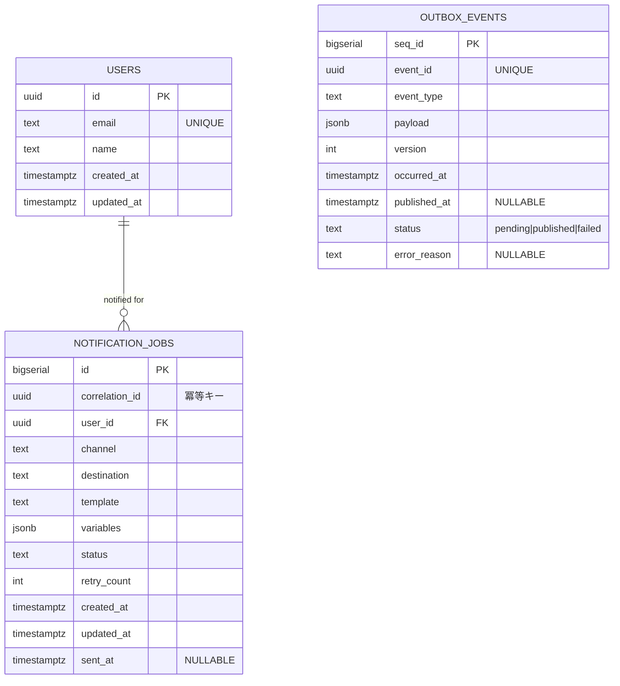

# SRE Skill-up Microservices Training

本リポジトリは、SREスキル向上のための 1ヶ月ハンズオン計画に基づいて構築する **マイクロサービス実践プロジェクト** です。  
Golang・PostgreSQL・gRPC(Connect)・Pub/Sub・Terraform・GKE を利用し、実際のSRE業務に即した設計/実装/デプロイを体験します。

---

## 📌 サービス概要

### ユースケース
- クライアントが **ユーザー登録** を行う  
- User Service が DB(Postgres) に保存し、イベント `user.created` を発火  
- Outbox パターンで確実にイベントを Pub/Sub へ publish  
- Notification Service がイベントを購読し、通知処理を実施（初期はメール送信のダミー）

### サービス構成
- **User Service**
  - REST (chi) / gRPC(Connect) API
  - Postgres (Cloud SQL) にユーザー保存
  - Outbox テーブルにイベント書き込み → Worker が Pub/Sub へ publish
- **Notification Service**
  - Pub/Sub 購読
  - `UserCreated` イベントを受け取り NotificationJobs に登録
  - 冪等性保証 (correlation_id)
- **Infra**
  - IaC: Terraform (GKE, Cloud SQL, Pub/Sub, IAM, VPC)
  - デプロイ: GKE (k8s manifests or Helm)
  - CI/CD: GitHub Actions

---

## 🗄️ データモデル (ER 図)



---

## 🔌 API & イベント

### User Service (REST)
- `POST /users`  
  - req: `{ "email": "alice@example.com", "name": "Alice" }`  
  - res: `201 { "id": "uuid" }`
- `GET /users/{id}`
- `GET /users?limit=&offset=`
- `GET /healthz`

### User Service (gRPC / Connect)
- `CreateUser(CreateUserRequest) returns (CreateUserResponse)`
- `GetUser(GetUserRequest) returns (GetUserResponse)`
- `ListUsers(ListUsersRequest) returns (ListUsersResponse)`

### Notification Service
- 基本は Pub/Sub イベント駆動
- 将来的に再送/テンプレ編集 API を追加可能

### イベント (Pub/Sub)
Topic: `user.events`

```json
{
  "event_id": "uuid",
  "event_type": "user.created",
  "version": 1,
  "occurred_at": "2025-09-27T12:00:00Z",
  "producer": "user-service",
  "payload": {
    "user_id": "uuid",
    "email": "alice@example.com",
    "name": "Alice"
  },
  "trace": {
    "trace_id": "xxx",
    "span_id": "yyy"
  }
}
```

---

## 📊 可観測性 & SLO

### メトリクス
- HTTP/gRPC: 成功率, レイテンシ(p95)
- Outbox: pending数, publish失敗数, publish遅延
- Notification: backlog, 失敗率, retry数
- DB: コネクションプール使用率, スロークエリ

### SLO (初期案)
- **User API 成功率**: 99.5% / 30日
- **User API p95 レイテンシ**: 300ms 以下
- **Outbox publish lag p95**: 30秒以下
- **Notification backlog size**: 閾値超過でアラート

---

## 📂 リポジトリ構成

```
.
├─ services/
│  ├─ user/
│  │  ├─ cmd/server/main.go              # メインエントリポイント
│  │  ├─ internal/
│  │  │  ├─ domain/                      # ドメインモデル
│  │  │  ├─ handler/                     # HTTPハンドラ
│  │  │  ├─ service/                     # ビジネスロジック
│  │  │  └─ repository/                  # データアクセス層
│  │  ├─ db/
│  │  │  ├─ migrations/                  # マイグレーションファイル
│  │  │  │  ├─ 001_create_users_table.up.sql
│  │  │  │  └─ 001_create_users_table.down.sql
│  │  │  └─ sqlc/                        # SQLC設定・生成コード
│  │  │     ├─ sqlc.yaml                 # SQLC設定ファイル
│  │  │     └─ queries.sql               # CRUDクエリ定義
│  │  ├─ proto/user/v1/*.proto           # Protocol Buffer定義
│  │  ├─ connect/ (generated)            # Connect生成コード
│  │  └─ Dockerfile
│  └─ notifier/
│     ├─ cmd/server/main.go
│     ├─ internal/
│     ├─ proto/notifier/v1/*.proto
│     ├─ connect/ (generated)
│     └─ Dockerfile
├─ platform/
│  ├─ terraform/ (gke, cloudsql, pubsub, iam, vpc, secrets)
│  └─ k8s/ (manifests or helm charts)
├─ ops/
│  ├─ runbooks/
│  └─ slo/
├─ docs/                                 # プロジェクトドキュメント
│  └─ week1_action_plan.md              # Week1実装計画
└─ .github/workflows/
```

---

## 🚀 開発環境の起動

```bash
# Postgres起動
docker compose up -d

# SQLC生成
(cd services/user/db/sqlc && sqlc generate)

# User Service 起動
go run ./services/user/cmd/server

# 疎通確認
curl -i http://localhost:8080/healthz
```

---

## ✅ Roadmap (学習ステップ)

1. **Week 1**: REST API + Postgres (CRUD + sqlc + Index)  
2. **Week 2**: gRPC(Connect) + goroutine/channel  
3. **Week 3**: Pub/Sub 非同期処理 + サービス分割  
4. **Week 4**: Terraform + GKE/Cloud SQL/CI/CD + 可観測性  

---
